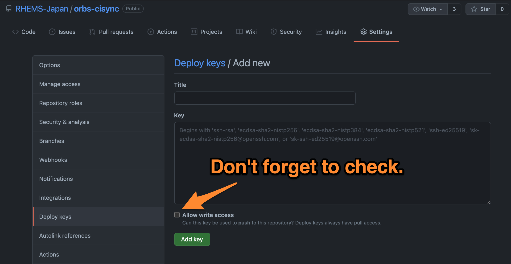
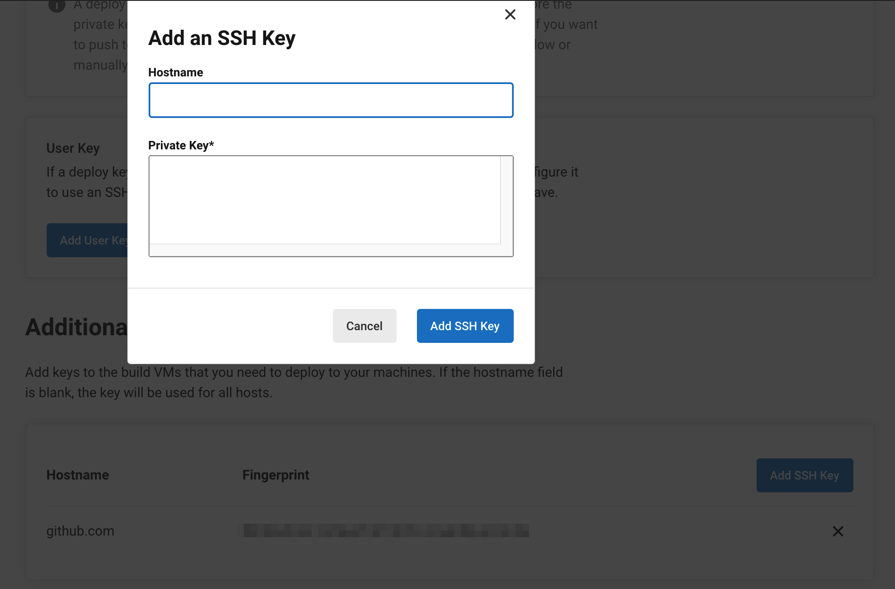

# CISYNC Orb

[](https://circleci.com/gh/RHEMS-Japan/orbs-cisync) [](https://circleci.com/orbs/registry/orb/rhems-japan/cisync) [](https://raw.githubusercontent.com/RHEMS-Japan/orbs-cisync/master/LICENSE) [](https://discuss.circleci.com/c/ecosystem/orbs)

## Usage

See [CircleCI's Orbs Registry](https://circleci.com/developer/orbs/orb/rhems-japan/cisync) for details on usage.

## Example

```yaml
version: 2.1

orbs:
  cisync: rhems-japan/cisync@x.y.z

workflows:
  your-workflow:
    jobs:
      - cisync/cisync:
          fingerprint: "SO:ME:FI:NG:ER:PR:IN:T"
```

## How to setup fingerprint

see [CircleCI's Docs](https://circleci.com/docs/2.0/gh-bb-integration/#creating-a-github-deploy-key) for details to setup fingerprint.

### 1. Create an SSH key pair.

Create an SSH key pair by following command. When prompted to enter a passphrase, do not enter one.

```bash
$ ssh-keygen -t ed25519 -C "your_email@example.com"
```

### 2. Add `Deploy Key` to GitHub repository settings

Go to GitHub repository settings, and add "Deploy Key". Enter a title in the "Title" field, then copy and paste the public key you created in step 1. **Check "Allow write access"**, then click "Add key".



### 3. Add `SSH Key` to CircleCI project settings

Go to CircleCI project settings, click on SSH Keys, and "Add SSH key", and add the private key you created in step 1. In the "Hostname" field, enter "github.com", and press the submit button.

Now you can get the fingerprint. Specify it as a parameters when calling job or command.

